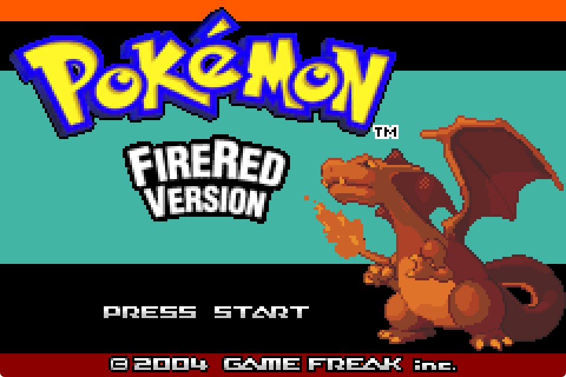
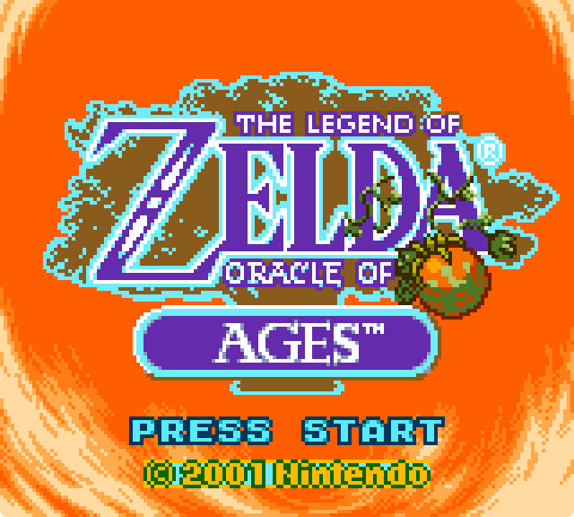
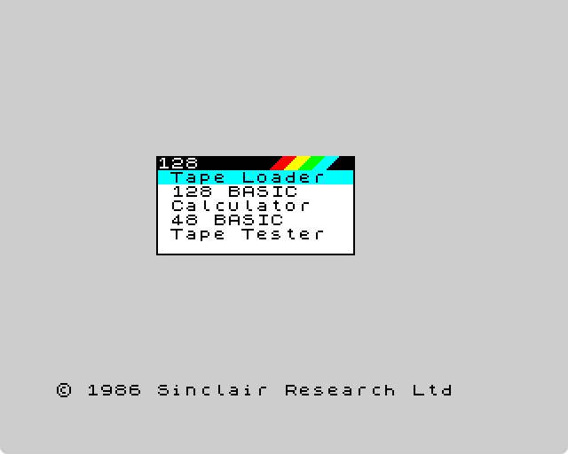
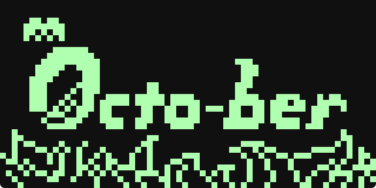

# rvvm-hal

A bare-metal Hardware Abstraction Layer for [RVVM](https://github.com/LekKit/RVVM)
— the lightweight RISC-V emulator. Target audience: people writing
M-mode (or S-mode-under-SBI) firmware that runs directly on RVVM
with no kernel, who want to ship anything from a 7 KB hello-world
to a full unikernel (libc + filesystem + TCP/IP + SMP) without
rolling each piece by hand.

<p align="center">
  <a href="assets/gallery/scev-gba-firered.png"></a>
  <a href="assets/gallery/scev-gameboy-zelda-ooa-intro.png"></a>
  <a href="assets/gallery/scev-gameboy-zelda-ooa-title.png"></a>
  <a href="assets/gallery/scev-zx-spectrum-128k.png"></a>
  <a href="assets/gallery/scev-chip-8-octojam.png"></a>
</p>

<sub>↑ Six-dollar emulator stack on top of this HAL: GBA (gdkGBA),
Game Boy (binjgb), ZX Spectrum 48K/128K, CHIP-8. Captured from real
runs of the firmwares listed under [Real-world consumers](#real-world-consumers).</sub>

The base HAL is ~2K lines of C exposing every device RVVM emulates.
Optional layers add picolibc, FatFs, and lwIP; each is opt-in via a
build flag and contributes zero bytes to firmwares that don't use it
(`-Wl,--gc-sections` trims aggressively, and `HAL_LTO=1` extends the
trim across translation units).

The privileged surface is split via two compile-time knobs
(`HAL_PRIV` × `HAL_PLAT`) so the same source builds for **M-mode
bare-metal + CLINT/PLIC** (default, today's RVVM target) or for
**S-mode-under-OpenSBI**, with reserved slots for `m_clic` (CLIC
controller) and `s_aia` (IMSIC/APLIC) backends. Adding a new backend
is a single `src/plat_<name>.c` file — see `include/plat.h`.

## Drivers — always available

| device | provides | RVVM source |
|---|---|---|
| `uart`   | NS16550A — `printf`, `getc`, hex dump | `src/devices/ns16550a.c` |
| `fdt`    | Flattened Device Tree walker — `compatible` lookup, `reg` decode | (consumed via `a1` at boot) |
| `pci`    | ECAM scanner, BAR readback, capability list, MSI configure | `src/devices/pci-bus.c` |
| `irq`    | SiFive PLIC + RISC-V trap dispatch | `src/devices/riscv-plic.c` |
| `smp`    | multi-hart detection (FDT `/cpus`), CLINT MSIP wakeup, `smp_start(hartid, fn, arg)` | `src/devices/riscv-aclint.c` |
| `time`   | `rdtime` CSR + CLINT mtimecmp idle-wait via `wfi` | `src/devices/riscv-aclint.c` |
| `rtc`    | Google Goldfish RTC — `rtc_now_seconds()`, wallclock | `src/devices/rtc-goldfish.c` |
| `atomic` | RV-A wrappers (`amoadd`/`lr`/`sc` typed inlines), `mutex_t` spinlock | — |
| `bochs`/`gfx`/`gfx_text` | Cross-host framebuffer — Bochs Display, simple-framebuffer, or QEMU virtio-gpu auto-select. `gfx_rect`/`gfx_fill` auto-flush; consumers writing through the raw pointer call `gfx_present_all()` per frame. Opt-in **page-flipped double buffer** on Bochs (`gfx_enable_double_buffer` + `gfx_flip`) — VIRT_HEIGHT-doubling trick gives whole-frame presentation in one register write, eliminates mid-blit tearing on cart-driven cores. `tools/bdf2c/` ships a BDF→C converter; `include/fonts/cozette_8x13.h` is the pre-generated Cozette ASCII subset | `src/devices/bochs-display.c` |
| `i2c`    | OpenCores I²C master — write / write-then-read, polling | `src/devices/i2c-oc.c` |
| `hid`    | Cross-host keyboard — same `hid_kb_init_fdt`/`hid_kb_poll` API. Auto-binds to RVVM's HID-over-I²C or QEMU's virtio-input. Both backends emit USB HID usage codes. | `src/devices/i2c-hid.c` (RVVM) |
| `nvme`   | NVMe-over-PCIe block device, chained PRP, large transfers | `src/devices/nvme.c` |
| `audio`/`hda` | Intel HDA controller — beep widget + raw 16-bit PCM streaming, ALSA-period-aligned BDL | `src/devices/sound-hda.c` |
| `eth`    | Realtek RTL8169 — descriptor-mode RX/TX, raw L2 frames | `src/devices/rtl8169.c` |
| `ui`     | menu / confirm / message / file-picker primitives, dual UART + GFX backend | — |
| `mmio`/`string` | volatile MMIO accessors, word-aligned mem*` helpers | — |

QEMU-only devices (driver auto-disables on RVVM via FDT compat miss):

| device | provides | host availability |
|---|---|---|
| `fw_cfg` | QEMU fw-cfg byte-stream — selector + data port, file directory walk | QEMU virt only (`qemu,fw-cfg-mmio`) |
| `cfi`    | CFI parallel-NOR flash — JEDEC query, size + cmdset, MMIO read | QEMU virt + most real virt-style boards (`cfi-flash`) |
| `virtio` | Modern virtio-mmio transport (v2): probe, feature negotiation, split-virtqueue, push/pop/notify | QEMU virt and most virt-style boards (`virtio,mmio`) |
| `virtio_input` | virtio-input device — drains eventq, translates Linux keycodes → USB HID usages. Used by `hid` automatically when no I²C-HID is present. | QEMU virt with `-device virtio-keyboard-device` etc |
| `virtio_gpu`   | virtio-gpu (2D) device — display info, resource_create_2d, attach_backing, set_scanout, transfer + flush. Used by `gfx` automatically when no Bochs / simplefb is present. | QEMU virt with `-device virtio-gpu-device` |

Plus `rvvm.h` — the topology header. Documents every magic address,
PCI device ID, and register offset RVVM uses, with cross-refs back
into RVVM's source.

## Optional layers — opt-in via `HAL_X=1`

| flag | adds | size in firmware |
|---|---|---|
| `HAL_PICOLIBC=min` | picolibc 1.8.11 — `<stdio.h>`, `<stdlib.h>`, `<string.h>`, `<ctype.h>`, integer printf | ~3-10 KiB depending on use |
| `HAL_PICOLIBC=std` | + float/double printf, `<math.h>`, 64-bit `%lld` | +20-40 KiB depending on use |
| `HAL_FATFS=1` | FatFs r0.15a — FAT12/16/32/exFAT RW on top of NVMe | ~11 KiB for typical f_open/read/write |
| `HAL_LWIP=1` | lwIP 2.2.1 — DHCP, ARP, ICMP, IP, TCP, UDP, DNS | ~50-150 KiB depending on use |
| `HAL_NO_SMP=1` | strips multi-hart support (single-hart firmwares) | savings: ~3 KiB code + 64 KiB stack |

Each flag must be set on **both** the HAL build and your firmware's
own CFLAGS so prototypes match symbols. Without flags, the HAL stays
at its bare-metal baseline (~30 KiB compiled, ~7 KiB after gc).

## Privilege / platform — `HAL_PRIV` × `HAL_PLAT`

The privileged surface (CSR aliases, IPI, timer, interrupt controller,
hart bring-up) is abstracted via `include/priv.h` (CSR aliases) and
`include/plat.h` (platform ops). Two knobs select the build:

| `HAL_PRIV` | `HAL_PLAT` (default `m_clint`) | what runs |
|---|---|---|
| `m` (default) | `m_clint` | M-mode bare-metal on the stock RVVM machine. CLINT for IPI/timer, PLIC for IRQs. Today's only fully-tested target. |
| `s` | `s_sbi` | S-mode payload under OpenSBI. SBI ecalls for IPI / timer / hart-start; PLIC at the S-mode context. Sstc fast-path auto-engages when the FDT advertises it. |
| `m` | `m_clic` (planned) | M-mode + CLIC interrupt controller. Reserved file shell. |
| `s` | `s_aia` (planned) | S-mode + IMSIC/APLIC + Sstc. Reserved file shell. |

Adding a backend = drop a new `src/plat_<name>.c` implementing the
~12 functions in `plat.h`. Sync exception handling, panic dumper,
trap entry, and `irq.c` dispatch are all privilege-portable through
the `priv.h` aliases.

S-mode firmware builds at load address `0x80200000` via `link_s.ld`;
run as `rvvm <opensbi-fw_jump.bin> -k firmware.bin`. See
[`examples/probe-s/`](examples/probe-s/) for a working setup.

## Compile-time perf knobs

| flag | default | effect |
|---|---|---|
| `HAL_OPT` | `s` (size-leaning) | `-O$(HAL_OPT)`. `HAL_OPT=2` for speed-leaning. |
| `HAL_LTO` | `` (off) | `HAL_LTO=1` enables full LTO. Requires LLVM-aware linker (`zig cc` / `lld` / `clang`). With LTO, consumer firmware.bin shrinks ~40-50% (the linker drops unused HAL surface across TUs) and `irq-entry` paths get inlined. The bench / probe / probe-s examples default to `HAL_LTO=1`. |
| `HAL_MARCH_EXTS` | `zba zbb zbs zicond zicclsm zicboz` | RISC-V extensions to enable beyond `rv64gc`. Defaults match the intersection of RVVM's `riscv_exts` and QEMU virt's default `rv64` cpu, so the same firmware boots on either. Compiler emits `czero.eqz/nez`, `sh*add`, `sext.b/h`, etc. |
| `HAL_MARCH_EXTS_EXTRA` | (empty) | Additional extensions appended to `HAL_MARCH_EXTS`. Use this to opt into ones outside QEMU's default `rv64` set — most usefully `zcb` for compressed byte/halfword load/store, a small code-size win in MMIO-heavy paths (~150 B off a typical firmware.bin). RVVM enables Zcb unconditionally; QEMU needs `-cpu rv64,zcb=true`. |
| `HAL_NO_ASM_STRING` | `` (off) | `HAL_NO_ASM_STRING=1` falls back to the C `string.c`. The default asm versions in `string_asm.S` are 2-4× faster on memcpy/memmove. |
| `HAL_NO_SSTC` | `` (off) | A/B knob for the S+SBI build. `HAL_NO_SSTC=1` forces the `sbi_set_timer` ecall path even when Sstc is advertised. |

## Build

Requires `zig` (used as `zig cc -target riscv64-freestanding-none`)
and `llvm-ar`. The flake provides both, plus `meson` + `ninja` for
picolibc:

```sh
nix develop --command make                   # baseline libhal.a
nix develop --command make HAL_PICOLIBC=min  # + libc
nix develop --command make HAL_PICOLIBC=min HAL_FATFS=1            # + FS
nix develop --command make HAL_PICOLIBC=min HAL_FATFS=1 HAL_LWIP=1 # full unikernel
```

First-time picolibc/lwIP builds also fetch the submodules:

```sh
git submodule update --init --recursive
make picolibc-min picolibc-std    # one-time, ~30s each
```

## Use from your own firmware

Add as a git submodule:

```sh
git submodule add https://github.com/SolAstrius/rvvm-hal vendor/rvvm-hal
git -C vendor/rvvm-hal submodule update --init --recursive
```

Minimal `Makefile`:

```make
HAL := vendor/rvvm-hal

CFLAGS  += -I$(HAL)/include
LDFLAGS += -Wl,-T,$(HAL)/link.ld -Wl,--gc-sections

$(HAL)/libhal.a:
	$(MAKE) -C $(HAL)

firmware.elf: $(YOUR_OBJS) $(HAL)/libhal.a
	zig cc -target riscv64-freestanding-none -nostdlib -static \
	    $(LDFLAGS) -o $@ $(YOUR_OBJS) $(HAL)/libhal.a
```

Minimal `main.c`:

```c
#include "uart.h"

void kmain(uint64_t hartid, uint64_t fdt_addr) {
    uart_init(0);
    uart_puts("hello from RVVM bare metal!\n");
    for (;;) __asm__ volatile ("wfi");
}
```

`src/start.S` provides `_start` — parks secondary harts in `wfi`
on `mie.MSIE`, sets per-hart sp from `__stack_top`, zeroes BSS,
forwards `a0=hartid` + `a1=fdt_addr` into `kmain`. Per-hart 16 KiB
stacks reserved by `link.ld` (8 × 16 KiB = 128 KiB total).

## Run on RVVM

```sh
# Bare metal: UART only
rvvm firmware.bin -nogui -nonet -nosound

# With graphics + keyboard
rvvm firmware.bin -bochs_display

# With NVMe-backed disk image
rvvm firmware.bin -nvme mydisk.img

# Multi-core
rvvm firmware.bin -smp 4

# Networking (default; -nonet to disable)
rvvm firmware.bin -portfwd udp/2007=7   # forward host:2007 → guest:7
```

## Run on QEMU

The HAL is FDT-driven: every MMIO base, IRQ source, and timer rate is
discovered from the device tree at boot. QEMU's `virt` machine happens
to share every magic address RVVM's default machine uses (NS16550A at
`0x10000000`, CLINT at `0x02000000`, PLIC at `0x0c000000`, PCI ECAM at
`0x30000000`, syscon at `0x00100000`, goldfish-rtc at `0x00101000`),
so **the same `firmware.elf` runs unchanged on both** — only the host
launcher differs.

```sh
# S-mode build (HAL_PRIV=s HAL_PLAT=s_sbi) under OpenSBI:
make -C examples/probe-s run        # → RVVM
make -C examples/probe-s run-qemu   # → QEMU virt + bundled OpenSBI

# M-mode build, bare-metal:
make -C examples/probe run-headless # → RVVM
make -C examples/probe run-qemu     # → QEMU virt, -bios none

# Or from the HAL root:
make run-qemu-probe-s
make run-qemu-probe
```

Top-level Makefile defines `QEMU_CPU` matching the default
`HAL_MARCH_EXTS` set (Zba/Zbb/Zbs/Zicond/Zicboz). All of these are
in QEMU's default `rv64` cpu too, but we list them explicitly so a
custom `-cpu` on the QEMU side doesn't accidentally drop one. If you
opt into `HAL_MARCH_EXTS_EXTRA=zcb` for the size win on RVVM, append
`zcb=true` to `QEMU_CPU` to keep QEMU compatible.

What works on QEMU virt with the same binary:
- Boot, traps, panic dumper, BSS zero, per-hart stacks, FP context
- UART (NS16550A), CLINT, PLIC, syscon poweroff
- Time subsystem (mtime via CLINT, or Sstc direct-CSR under SBI)
- SMP (CLINT MSI in M-mode, SBI HSM in S-mode)
- SBI ecalls — `sbi_set_timer`, IPI, HSM, SRST

What's RVVM-only and won't activate on QEMU (the FDT compatible
strings don't match, so the drivers never engage):
- Bochs Display, opencores-i2c, i2c-HID, C-Media HDA, ATA, RTL8169
- NVMe (QEMU has it but with a different vendor/device ID path)
- Anything in `examples/{audio-*,fs-hello,eth-hello,net-hello,ui-hello}`

`examples/probe-s` is the cross-host smoke test: same binary, boots
under either, exits cleanly via SBI SRST. It also dumps the entire
FDT — see [`docs/devicetree.md`](docs/devicetree.md) for a side-by-side
RVVM-vs-QEMU comparison and captured snapshots.

## Examples

| example | demonstrates |
|---|---|
| [`examples/probe/`](examples/probe/) | bare HAL surface — FDT walk, gfx auto-select, NVMe LBA0 dump, IRQ-driven UART RX |
| [`examples/audio-beep/`](examples/audio-beep/) | HDA codec beep widget — C-major scale via `audio_beep(hz)` |
| [`examples/audio-edge/`](examples/audio-edge/) | emulator-cycle-driven 1-bit speaker — Speccy/Apple II shape |
| [`examples/audio-pcm/`](examples/audio-pcm/) | raw 16-bit PCM streaming with continuous-feed pattern |
| [`examples/smp/`](examples/smp/) | multi-hart wake-up + atomic/mutex contention test (200K iters × 4 harts) |
| [`examples/picolibc-hello/`](examples/picolibc-hello/) | real `printf` / `malloc` / `strtol` / `qsort` |
| [`examples/fs-hello/`](examples/fs-hello/) | exFAT image: `f_open` / `f_read` / `f_write` / `f_size`, file persists across boots |
| [`examples/eth-hello/`](examples/eth-hello/) | RTL8169 raw L2: ARP request → reply, decode |
| [`examples/net-hello/`](examples/net-hello/) | full TCP/IP — DHCP client gets an IP, UDP echo server on port 7 |
| [`examples/ui-hello/`](examples/ui-hello/) | menu primitives — top-level menu, file picker, yes/no dialog, message banner |
| [`examples/cozette-hello/`](examples/cozette-hello/) | Cozette 6×13 bitmap font (ASCII) rendered through `gfx_text_t` — drives `tools/bdf2c/` to regenerate `include/fonts/cozette_8x13.h` from the vendored BDF |
| [`examples/probe-s/`](examples/probe-s/) | **S-mode under OpenSBI** — same drivers, `csrr sstatus` smoke test, Sstc-vs-ecall timer comparison |
| [`examples/bench/`](examples/bench/) | microbenchmarks — memcpy/memset/memmove × 1 MiB, gfx_rect 1024×256, self-IPI trap entry |

## Debugging

The HAL ships a panic / assert / clean-exit primitive set built around
a single structured UART format. Three call sites that matter:

| call | when |
|---|---|
| `hal_panic("msg %d", x)` | unrecoverable error; capture call site, dump regs + backtrace, hang |
| `hal_exit(code)`         | clean shutdown; logs `!!HAL-EXIT code=N`, writes SYSCON_POWEROFF, RVVM exits |
| `HAL_CHECK(cond)`        | always-live invariant; failure routes to `hal_panic` |
| `HAL_ASSERT(cond)`       | debug-only invariant; compiles to `((void)0)` without `-DHAL_DEBUG` |

Hardware traps that aren't handled (load-fault, illegal instruction,
ecall from M, page-fault, …) reach the same dumper via the trap path
in `src/irq.c`, so any bug — your code or the HAL's — produces an
identical, parseable frame.

### The panic format

Every panic emits a stable `!!HAL-PANIC-V1` block on UART:

```
!!HAL-PANIC-V1 ============================================
   cause      : load access fault (mcause=0x05)
   mepc       : 0x0000000080003a4c
   mtval      : 0x00000000deadbeef
   mstatus    : 0x0000000000001880
   mtvec      : 0x0000000080012080
   mhartid    : 0
   ----
   x0   zero  : 0x0000000000000000
   x1   ra    : 0x0000000080004f10
   ...
   x31  t6    : 0x0000000000000000
   ----
   stack:
     #0  0x0000000080003a4c
     #1  0x0000000080004f10
     #2  0x0000000080008a04
   ...
!!HAL-PANIC-V1 end ========================================
```

The format is versioned (V1) so future changes can be tooling-aware.
Re-entrant panics (a fault inside the dumper itself, or a parallel
panic on another hart) short-circuit to `wfi` so the on-wire dump
stays readable.

### Symbolicating the dump

```sh
rvvm firmware.bin -nogui 2>&1 | tee /tmp/uart.log
./tools/decode-panic firmware.elf < /tmp/uart.log
```

`decode-panic` rewrites every `0x80…` literal through `addr2line`,
yielding `function at file:line` annotations next to each PC, register
value, and backtrace frame. Picks `llvm-addr2line` first, then any
`riscv64-*-addr2line`, then plain `addr2line` (which only works if
your host binutils was built multi-arch). Override with
`RVVM_ADDR2LINE=/path/to/addr2line`.

For the backtrace to extend past `mepc + ra`, build the HAL **and**
your firmware with `make DEBUG=1` (frame pointers are required for
the fp-walk).

### `make DEBUG=1`

Swaps `-Os` for `-Og -g3 -gdwarf-4 -fno-omit-frame-pointer`, adds
`-DHAL_DEBUG` (lights up `HAL_ASSERT`), and turns on trap-mode UBSan
(`-fsanitize=undefined -fsanitize-trap=undefined`). UB at runtime
becomes an "illegal instruction" trap that prints through the panic
dumper, so signed overflow / shift-out-of-range / null-deref get
caught with a backtrace to the offending line.

Mirror the flag in your firmware's own Makefile so prototype
visibility (the `HAL_ASSERT` macro in particular) matches the HAL
build.

### Live debugging via gdb

RVVM has a built-in gdbstub. Launch the VM paused with the gdbstub
flag (see RVVM's own `-h`), then attach any RV64-aware gdb:

```sh
gdb-multiarch firmware.elf
(gdb) target remote :1234
(gdb) break kmain
(gdb) continue
```

Source-level breakpoints, register inspection, and step are all
available. Loading the ELF gives gdb the symbols + DWARF that the
panic dumper otherwise needs `decode-panic` to resolve.

## Real-world consumers

| consumer | uses | shot |
|---|---|---|
| [**scev-chip-8**](https://github.com/SolAstrius/scev-chip-8) | bare HAL — UART, gfx, HID, NVMe | [](assets/gallery/scev-chip-8-octojam.png) |
| [**scev-zx-spectrum**](https://github.com/SolAstrius/scev-zx-spectrum) | bare HAL + custom snapshot loader, audio_edge beeper | [](assets/gallery/scev-zx-spectrum-128k.png) |
| [**scev-gameboy**](https://github.com/SolAstrius/scev-gameboy) | + picolibc-min, vendored binjgb, audio_pcm stereo | [](assets/gallery/scev-gameboy-zelda-ooa-title.png) |
| [**scev-gba**](https://github.com/SolAstrius/scev-gba) | + picolibc-min, vendored gdkGBA, 76 MiB BSS | [](assets/gallery/scev-gba-firered.png) |
| [**scev-cores/apple-1**](https://github.com/SolAstrius/scev-cores/tree/master/apple-1) | + picolibc-min, gfx_text terminal | — (UART/text) |
| [**scev-cores/basic**](https://github.com/SolAstrius/scev-cores/tree/master/basic) | bare HAL + custom shim, vendored bwbasic 3.20 | — (UART REPL) |

Each pins this repo via submodule. Working references for every
opt-in flag combination.

## Versioning

Git-tagged following semver. Pin a specific version in your submodule
for stability:

```sh
git -C vendor/rvvm-hal checkout v1.0.0
git add vendor/rvvm-hal && git commit -m "pin rvvm-hal v1.0.0"
```

API contract (post-1.0): driver functions don't break across minor
versions. New optional layers and additions go to minor bumps;
breaking changes go to major bumps.

## License

MIT-ish for the HAL itself. Treat as public-domain reference code.

Vendored libraries live under `vendor/` with their own licenses
(all permissive — picolibc is BSD-1c, FatFs is BSD-1c, lwIP is
BSD-3c). The RVVM-side device emulators it talks to are in
`LekKit/RVVM` under MPL-2.0 — the address constants and register
layouts in `include/rvvm.h` were derived from reading that source.
RVVM itself isn't redistributed here.
